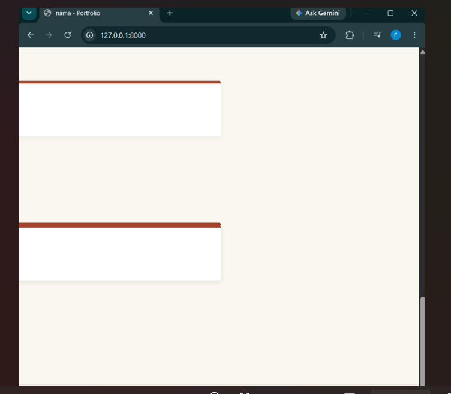
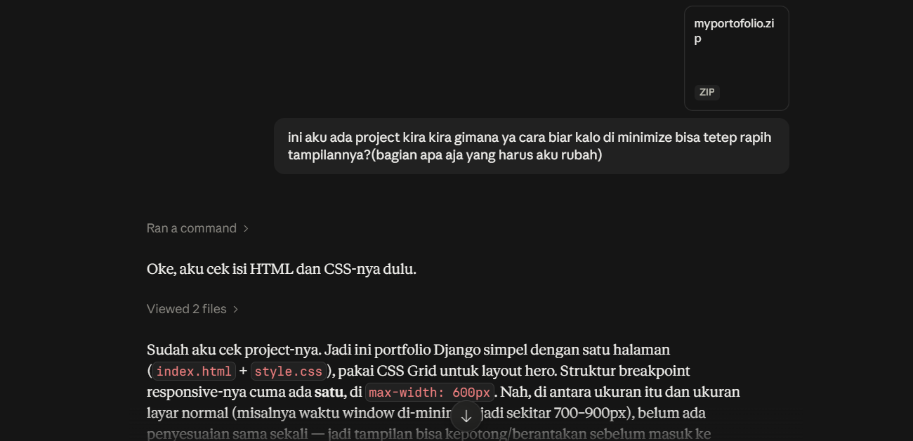
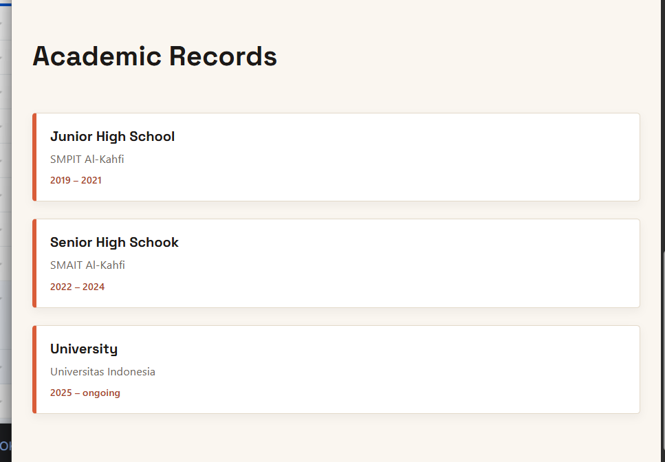
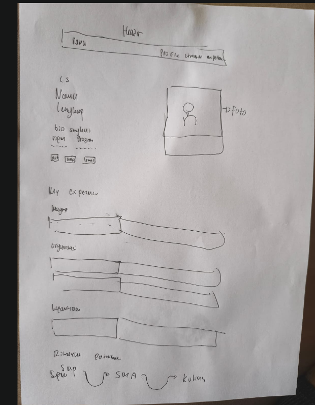
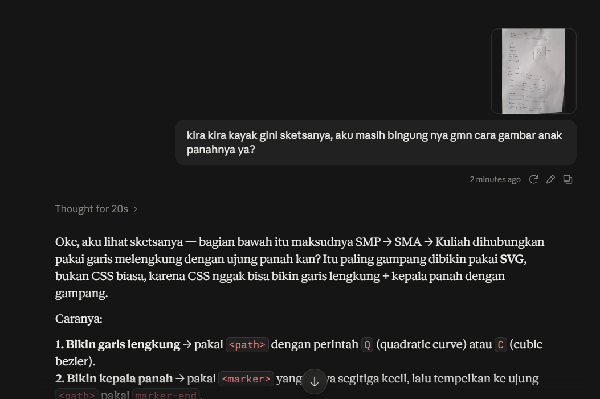
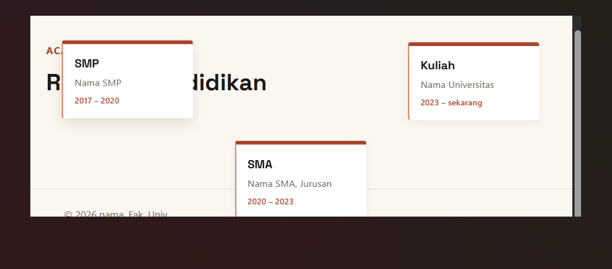
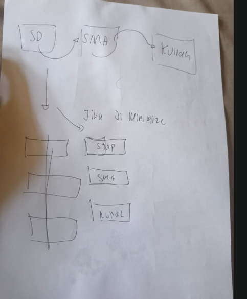

Nama : Fata Akhmad Aulia
NPM : 2506540853
kelas : PBP G

Jadi step by step saya mengerjakan ini, pada awalnya saya ingin memutuskan dulu mau nambahin section apa.
Pada awalnya saya hanya ingin menambahkan experience tapi karna merasa kurang saya tambahkan section riwayat akademik

Setelah menemukan ide awal, saya membuka kode saya bekas tutorial 1, disitu saya coba untuk memahami lebih lanjut apa kode saya itu sebelum saya memulai menambahkan.
setelah mempelajarinya saya mencoba dulu secara sendiri dengan refrensi kode yang sudah ada, namun stelah saya mencobanya malah jadi seperti ini kalo di minimize

jadinya gambarkan sketsanya di kertas agar jelas  dan saya memutuskan untuk minta bantuan AI untuk tolong saya gimana si cara rapiin agar jadi rapih ketika di minimize. 

setelah membuat yang section experience, saya coba membuat bagian yang my academic records, pada awalnya saya cukup copy paste bagian yang my experience dan diganti aja title nya jadi seperti ini , namun setelah itu saya sadar bahwa agak boring aja kalo sama jadi aku coba ngesketsa ulang jadi seperti ini , untuk smp, sma dan kuliah aku bikin cards masing masing dan anak panah buat ngehubunginnya.

Karna pada awal aku bingung gimana cara biar ada anak panah yang bisa ngelengkung gitu, aku akhirnya coba nanya AI lagi tentang gimana si cara gambar anak panahnya dengan ngasih sketsa bikinan di awal 

setelah itu saya coba mengupdatenya sendiri dengan bantuan ai yang tadi sudah dikasih, pada awalnya garis yang menghubungkan cards malah ga kesambung dengan cardsnya, setelah beberapa adjustment akhirnya jadi.
Namun saat saya lagi testing dan ubah ke minimize ada masalah baru,  jadi berantakan banget kalo di minimize. Aku coba otak atik sendiri dengan mengubah size cards nya, menurunkan tinggi cards nya, namun masih berantakan.

Setelah memikirkannya sampe keesokan hari akhirnya saya punya ide, jadi di mode tab normal akan terliha cards dengan panah yang menghubunginya seperti biasa dan ketika di minimize tampilannya akan berubah mengikuti yang experience, agar ga bingung nantinya saya memutuskan buat gambarin dulu sketsanya  Setelah itu dengan bantuan AI buat tau gimana caranya ngerubah tampilnnya ketika di minimize, Dan portofolio nya pun selesai

### Tugas 1

1. Ya, jadi saya pakai beberapa elemen semantik <header> untuk bagian nav/brand di atas, <main> untuk membungkus konten utama, <section> untuk tiap blok konten (hero/profile dan journey/experience-education), serta <footer> untuk bagian bawah.

buat manfaatnya si elemen semantik ini bikin struktur halaman lebih jelas maknanya (bukan cuma 
 semua)  dan memudahkan saya sendiri saat membaca/mengedit kode karena tiap bagian punya batas yang jelas misalnya waktu nambah section "Journey" kemarin saya  tinggal taruh <section> baru di dalam <main> tanpa bingung struktur sebelumnya.

2. Tantangan yang saya rasakan adalah waktu ukuran layar di minimize jadi sekecil HP tapi juga gak selebar laptop, tampilannya jadi berantakan apa lagi yang bagian academic records. 

Cara saya menentukan mana yang perlu diubah: saya lihat bagian mana yang ukurannya udah gede dari sananya, kayak foto profil dan judul nama, itu yang paling gampang kelihatan aneh kalau ruangnya dipersempit, jadi itu yang saya atur duluan supaya ikut mengecil menyesuaikan layar. Tantangan paling besarnya di academic records jadi agar bisa terlihat rapi walau di minimize saya ngide kalo di minimize tampilannya jadi kayak yang experience

3. Karena websitenya masih static (isinya ditulis langsung di file HTML), kalau saya mau update sesuatu  misalnya nambah pengalaman baru atau ganti riwayat sekolah saya harus buka lagi file HTML-nya terus edit manual satu-satu. Ini kurang praktis kalau kontennya sering berubah, dan lumayan ribet karena formatnya berulang-ulang jadi gampang salah ketik atau lupa update salah satu bagian.

Untuk pengembangan selanjutnya, saya pengen nambahin sesuatu yang lebih dinamis, misalnya bikin data pengalaman dan riwayat pendidikan itu tersimpan terpisah (bukan ditulis langsung di HTML), jadi kalau mau update tinggal ganti datanya aja tanpa perlu edit ulang tampilan HTML dan cssnya.